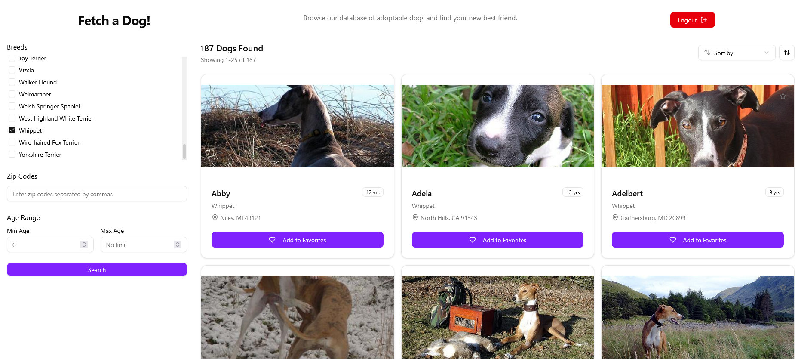

Front-end Engineer take-home exercise for Fetch Rewards.
Uses vite and shadcn-ui to streamline development.

To run locally: clone and open in IDE. create .env file in the project root. Add the line "FETCH_API_BASE_URL=https://frontend-take-home-service.fetch.com/" and save. Run `npm install` and `npx vite` and then click the local URL or enter it in your browser.

Design decisions:
While keeping persistent auth would reduce login calls and provide a better user experience, the short expiry window and temporary nature of the project makes me lean towards ignoring it.
For a more permanent project I would use Json Web Tokens due to my familiarity with them.

Using a single api file rather than separate auth, dogs, locations folders and files due to the temporary nature of the project + known, static scope of the project.

I implemented a map selection solution with Leaflet, but ended up removing it because it was too buggy.

